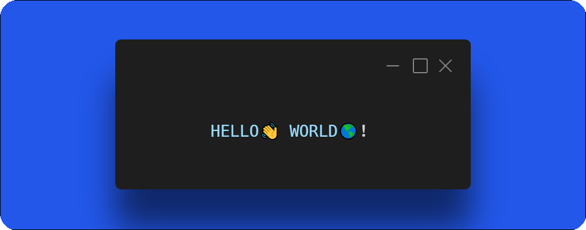

<h1 align="center">𝐇𝐞𝐥𝐥𝐨, 𝐟𝐞𝐥𝐥𝐨𝐰 <𝚌𝚘𝚍𝚎𝚛𝚜></𝚌𝚘𝚍𝚎𝚛𝚜>!  

  

# 🚀 About

- 💬 A calm sea does not make an excellent sailor.
- 📫 a1231231233@foxmail.com
- 🚀个人博客：⚽Jayfar[博客](https://jayfar.top/)、🥚Justnav [导航](https://justnav.us.kg/)
- 🌏社交网站：有需要在更新...

# 🛠 Tech Stack

> skills

- 🔭 back-end： 

- 👯 front-end：  

- :hammer_and_wrench: use-tool： 

- ⚙️ om：

- 💻 db：

- 🌱 learning

# 🔭Actions

<picture>
  <source media="(prefers-color-scheme: dark)" srcset="https://raw.githubusercontent.com/holic-x/holic-x/output/github-contribution-grid-snake-dark.svg">
  <source media="(prefers-color-scheme: light)" srcset="https://raw.githubusercontent.com/holic-x/holic-x/output/github-contribution-grid-snake.svg">
  
</picture>
